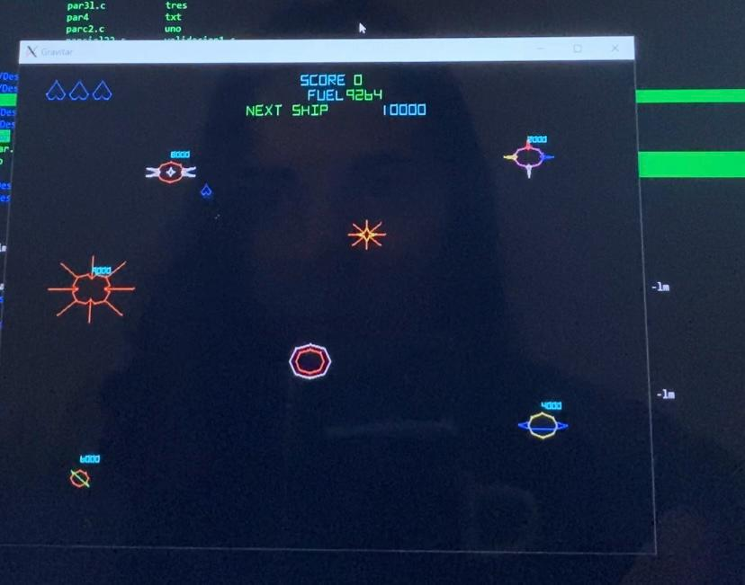
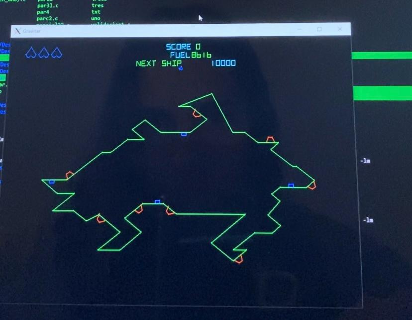
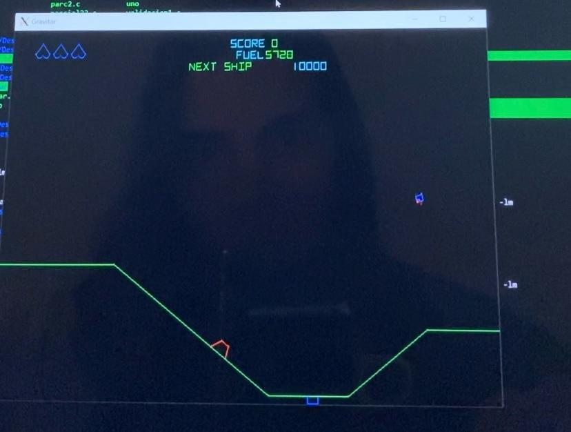
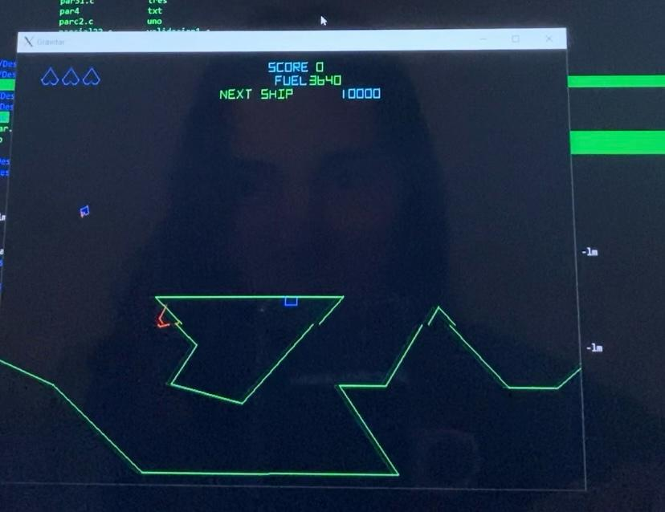
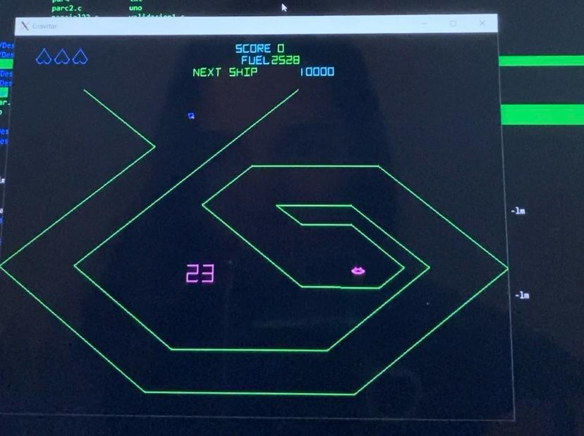
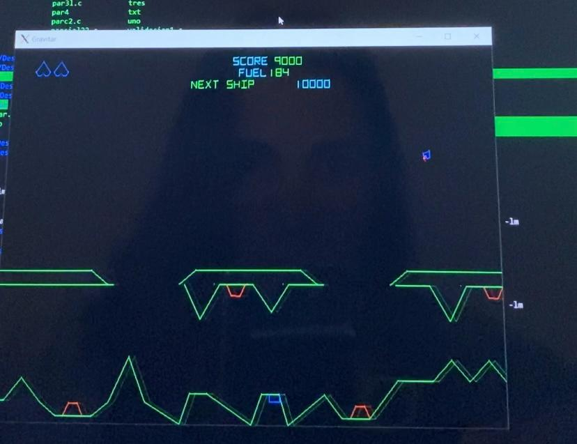

# Gravitar-Atari
Video juego inspirado en la version de Gravitar Atari 1982 utilizando gráficos de líneas en SDL2.
Realizado como proyecto final junto con un compañero, @LautiDO, en la materia 'Algoritmos y Programacion I' (1er cuatrimestre 2022) dada en FIUBA.
Este video juego consta con un menu inicial donde se muestran una nave, la cual la manipula el usuario, diferentes planetas y una estrella, cada planeta representa un nivel con una complejidad dada.

##  Nave
Se tuvo en cuenta la fisica del juego, calculando una 'gravedad' que afecta a la nave en el menu inicial y en cada planeta(los cuales representan diferentes niveles).
La nave posee 3 vidas, estas se pueden perder al ser atraida por la gravedad de la estrella del menu principal o al morir en un nivel.

## Estrella 
Esta estrella del menu principal cumple la funcion de generar una 'gravedad', lo cual dificulta la movilidad de la nave. En el caso de que la nave caiga en la estrella, la misma pierde una vida.

## Planetas 
Existen cuatro planetas en el menu inicial. Para acceder a cada planeta la nave debe pasar por encima del mismo. 
Cada planeta posee si fisica correspondiente, es decir, tiene su propia gravedad que afecta a la nave.
A medida que se van superando los niveles se obtienen puntos hasta eventualmente ganar.

## Memoria
En este proyecto se utilizo el lenguaje C manejando la memoria dinamica y testeando con Valgrind. 
Las figuras del videojuego se guardaron por unica vez en la memoria, mientras que las variables fueron guardadas en el heap.

## Ejecucion
para poder compilar y ejucat el programa se debe contar con la aplicacion XLaunch

## Imagenes
Las siguientes imagens muestran el menu inicial y los distintos niveles.

